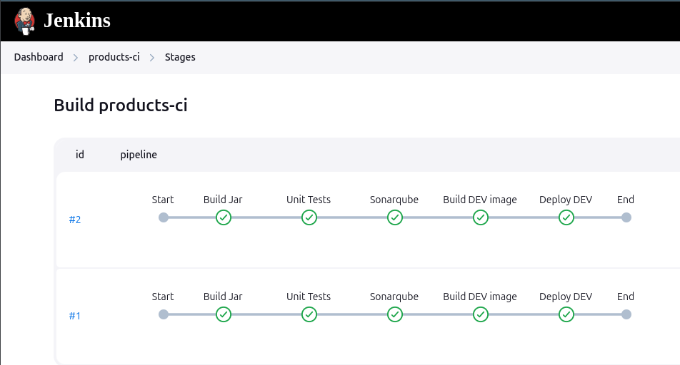
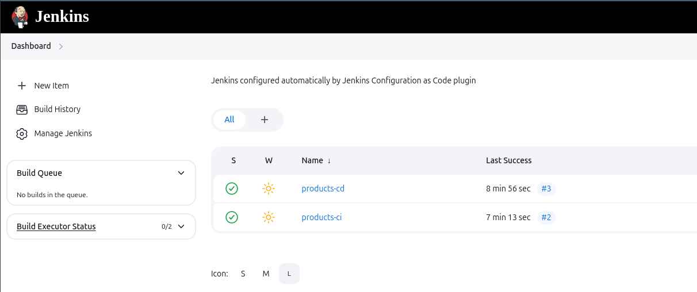
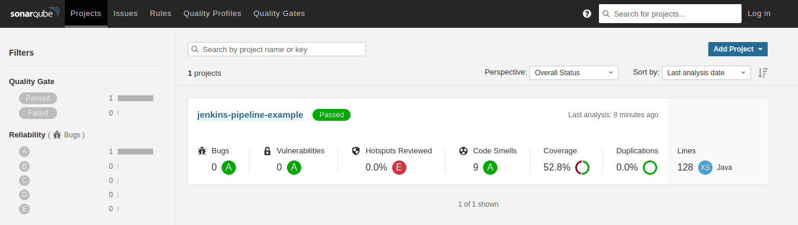

# Jenkins Pipeline Example

## Goal

The purpose of this project is to demonstrate, through a simple project, how a software delivery pipeline can be assembled using Jenkins.

Some important steps are included in this project, such as unit testing, interface testing, static code analysis, and deploying Docker images.

A pipeline can include more or fewer steps depending on your application scenario. The important thing is to understand the flow needed to deliver the application with confidence and to automate this flow.

Use this project as a basis for ideas for your own pipeline.



## Setup

Having Docker, Java 21 and Gradle installed, execute the commands below:

```
git clone git@github.com:robsonbittencourt/jenkins-pipeline-example.git

cd jenkins-pipeline-example

./gradlew clean build

sudo chmod 666 /var/run/docker.sock

docker-compose up -d
```

Permission to the docker.sock file is necessary for the Docker installed in the Jenkins container to access your local Docker.

After that some services will be available:

| **Application**      | **URL**               | **Description**                           |
| -------------------- | --------------------- | ----------------------------------------- |
| **App Products DEV** | http://localhost:8081 | Simple app in DEV environment             |
| **App Products UAT** | http://localhost:8085 | Simple app in UAT environment             |
| **App Products PRD** | http://localhost:8090 | Simple app in PRD environment             |
| **Docker Registry**  | http://localhost:5000 | A local Docker Registry to publish images |

### Jenkins

http://localhost:8080

Jenkins to run CI and CD jobs.



### Sonarqube

http://localhost:9000

Sonarqube is a tool that performs static code analysis and points out possible problems.



### Selenium Grid

http://localhost:4444/ui/index.html#/

Selenium grid allow run UI Selenium tests in a Docker environment

If you want to see tests running on browser access http://localhost:7900. The password is `secret`.


## Usage

When accessing Jenkins there are two jobs already configured:

#### products-ci

Run this job to build, test, analyse code, and running app in DEV environment

- Download the project from Github
- Run unit-tests
- Execute Sonarqube analysis
- Build jar artifact
- Build and deploy Docker image with DEV tag
- Run docker container using DEV tag

#### products-cd

This job update UAT environment, running UI tests and make deploy on PRD environent

- Download the project from Github
- Build and deploy Docker image with UAT tag
- Run docker container using UAT tag
- Run interface tests in UAT stage
- Build and deploy Docker image with PRD tag
- Run docker container using PRD tag
